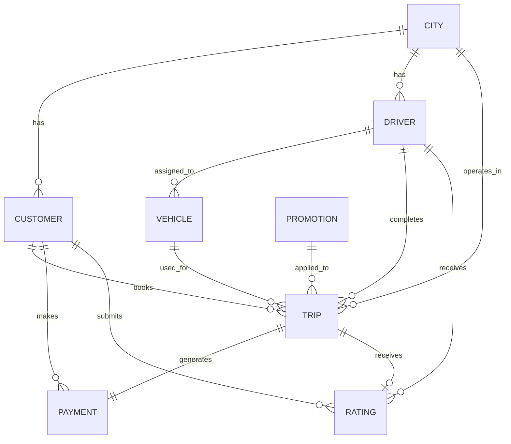
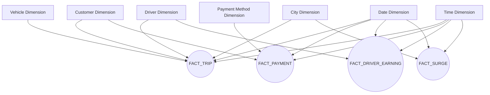

# Data Model

---

# Document Information

| Property | Value |
|----------|--------|
| Project | RideNow Enterprise Data Platform |
| Document | Data Model |
| File Name | 05_Data_Model.md |
| Version | 2.0 |
| Status | In Progress |
| Owner | Manmeet Singh |
| Repository | RideNow Enterprise Data Platform |
| Last Updated | 14-Jul-2026 |

---

# Revision History

| Version | Date | Author | Description |
|----------|------|--------|-------------|
| 1.0 | 13-Jul-2026 | Manmeet Singh | Initial version |
| 2.0 | 14-Jul-2026 | Manmeet Singh | Enterprise structure finalized |

---

# Table of Contents

- [References](#references)
- [1. Introduction](#1-introduction)
- [2. Business Overview](#2-business-overview)
- [3. Business Process](#3-business-process)
- [4. Naming Standards](#4-naming-standards)
- [5. Data Type Standards](#5-data-type-standards)
- [6. Audit Column Standards](#6-audit-column-standards)
- [7. Entity Catalog](#7-entity-catalog)
- [8. Master Data](#8-master-data)
  - [8.1 CUSTOMER](#81-customer)
  - [8.2 DRIVER](#82-driver)
  - [8.3 VEHICLE](#83-vehicle)
  - [8.4 CITY](#84-city)
  - [8.5 PROMOTION](#85-promotion)
- [9. Transaction Data](#9-transaction-data)
  - [9.1 TRIP](#91-trip)
  - [9.2 PAYMENT](#92-payment)
  - [9.3 RATING](#93-rating)
- [10. Dimension Tables](#10-dimension-tables)
  - [10.1 DATE_DIM](#101-date_dim)
  - [10.2 TIME_DIM](#102-time_dim)
- [11. Fact Tables](#11-fact-tables)
  - [11.1 FACT_TRIP](#111-fact_trip)
  - [11.2 FACT_PAYMENT](#112-fact_payment)
  - [11.3 FACT_DRIVER_EARNING](#113-fact_driver_earning)
  - [11.4 FACT_SURGE](#114-fact_surge)
- [12. Primary Keys](#12-primary-keys)
- [13. Foreign Keys](#13-foreign-keys)
- [14. Business Keys](#14-business-keys)
- [15. Surrogate Keys](#15-surrogate-keys)
- [16. Relationships](#16-relationships)
- [17. Cardinality](#17-cardinality)
- [18. ER Diagram](#18-er-diagram)
- [19. Star Schema](#19-star-schema)
- [20. Physical Implementation Mapping](#20-physical-implementation-mapping)
- [21. Business Rules](#21-business-rules)
- [22. Data Validation Rules](#22-data-validation-rules)
- [23. Data Generation Rules](#23-data-generation-rules)
- [24. Sample Data](#24-sample-data)
- [25. Estimated Data Volume](#25-estimated-data-volume)
- [26. Slowly Changing Dimensions (SCD)](#26-slowly-changing-dimensions-scd)
- [27. Future Enhancements](#27-future-enhancements)

---

# References

This document follows the enterprise standards defined in the Standards Library.

| Standard | Reference |
|----------|-----------|
| Naming Standards | docs/standards/01_Naming_Standards.md |
| Data Type Standards | docs/standards/02_Data_Type_Standards.md |
| Audit Column Standards | docs/standards/03_Audit_Column_Standards.md |
| SQL Coding Standards | docs/standards/04_SQL_Coding_Standards.md |
| Documentation Standards | docs/standards/07_Documentation_Standards.md |


## 1. Introduction

## Purpose

The RideNow Enterprise Data Platform is a comprehensive end-to-end data engineering project designed to demonstrate enterprise-level implementation of a modern cloud data warehouse using Snowflake.

The project simulates the data platform of a ride-hailing company similar to Uber or Ola, where data is generated continuously from multiple operational systems including customer applications, driver applications, payment gateways, and promotional services.

The primary objective is to design and implement a scalable, secure, and high-performance analytics platform following industry best practices and the Medallion Architecture (Bronze, Silver, Gold).

This repository is intended to showcase real-world data engineering concepts including:

- Enterprise Data Modeling
- Data Warehouse Design
- Snowflake Architecture
- ETL/ELT Pipeline Development
- Python-based Data Generation
- Incremental Data Loading
- Data Quality Validation
- Security and Governance
- Performance Optimization
- Business Intelligence Reporting

The project follows enterprise documentation standards to provide complete traceability from business requirements through implementation and reporting.

---

## Project Objectives

The objectives of this project are:

- Design an enterprise-grade data platform using Snowflake.
- Simulate realistic business data using Python.
- Implement Medallion Architecture (Bronze, Silver, Gold).
- Develop scalable ETL/ELT pipelines.
- Create dimensional models for analytics.
- Build executive dashboards and KPI reports.
- Demonstrate enterprise security and governance.
- Apply performance tuning and cost optimization techniques.
- Follow software engineering best practices using GitHub.

---

## Target Audience

This project is intended for:

- Data Engineers
- Snowflake Developers
- Data Architects
- Business Intelligence Developers
- Technical Interviewers
- Hiring Managers
- Students learning modern data engineering

## 2.  Business Overview

## Company Overview

RideNow Technologies Pvt. Ltd. is a fictional ride-hailing company that provides transportation services across multiple metropolitan cities in India.

The company connects passengers with registered drivers through a mobile application, enabling customers to book rides, make digital payments, rate drivers, and receive promotional discounts.

RideNow operates 24x7 and processes thousands of ride requests every day.

---

## Business Challenges

As RideNow expanded into multiple cities, data started growing rapidly across different operational systems.

The organization faced several business challenges:

- Data scattered across multiple systems
- Manual reporting processes
- Lack of centralized analytics
- Slow dashboard performance
- Limited historical data analysis
- Inconsistent business metrics
- Difficulty monitoring driver performance
- Increasing infrastructure costs

These challenges impacted operational efficiency and delayed business decision-making.

---

## Business Goals

RideNow aims to build a centralized enterprise data platform to:

- Consolidate operational data into a single source of truth.
- Provide near real-time reporting.
- Improve business decision-making.
- Monitor customer growth and retention.
- Analyze driver performance.
- Optimize pricing and surge strategies.
- Measure promotion effectiveness.
- Reduce operational costs.
- Support future AI and Machine Learning initiatives.

---

## Success Criteria

The project will be considered successful when it can:

- Process large volumes of ride data efficiently.
- Deliver trusted business KPIs.
- Support scalable analytics.
- Maintain high data quality.
- Provide secure access to sensitive data.
- Enable executive dashboards with fast query performance.

## 3. Business Process

The RideNow platform follows a standard ride lifecycle from customer registration to trip completion and payment settlement.

## End-to-End Business Flow

1. Customer registers using the RideNow mobile application.
2. Driver registers and completes verification.
3. Vehicle details are mapped to the driver.
4. Customer books a ride.
5. The system assigns the nearest available driver.
6. Driver accepts the ride request.
7. Customer is picked up.
8. Trip begins.
9. Trip ends at the destination.
10. Fare is calculated based on business rules.
11. Customer completes payment.
12. Driver earnings are calculated.
13. Customer provides a rating and feedback.
14. Business dashboards are updated for reporting and analytics.

---

## Data Sources

The platform receives data from multiple operational systems:

| Source System | Data Generated |
|--------------|----------------|
| Customer Mobile App | Customer registration, bookings |
| Driver Mobile App | Driver availability, trip updates |
| GPS Service | Route and distance information |
| Payment Gateway | Payment transactions |
| Promotion Engine | Coupon and discount usage |
| Rating Service | Customer feedback |
| Notification Service | Ride alerts and notifications |

---

## High-Level Data Flow

Customer App
        │
Driver App
        │
Payment Gateway
        │
Promotion Engine
        │
GPS Service
        │
        ▼
Python Data Generator
        ▼
CSV Files
        ▼
AWS S3
        ▼
Snowflake Stage
        ▼
Bronze Layer
        ▼
Silver Layer
        ▼
Gold Layer
        ▼
Power BI / Tableau Dashboards

## 4. Naming Standards

The RideNow Enterprise Data Platform follows standardized naming conventions for all databases, schemas, tables, views, SQL scripts, Python programs, documentation, and GitHub artifacts.

These standards ensure consistency, readability, maintainability, and simplify collaboration across development, testing, and production environments.

For complete naming conventions, refer to:

**docs/standards/01_Naming_Standards.md**

# 5. Data Type Standards

All data types defined in this document comply with the enterprise standards.

For details, refer to:

**docs/standards/02_Data_Type_Standards.md**

---

# 6. Audit Column Standards

All tables include standardized audit columns for lineage, traceability, and ETL monitoring.

For complete standards, refer to:

**docs/standards/03_Audit_Column_Standards.md**

---

# 7. Entity Catalog

> *Business entity inventory will be documented here.*

---

# 8. Master Data

Master Data represents the core business entities that define the RideNow ecosystem. These entities change relatively infrequently and are referenced by transactional data throughout the platform.

The Master Data layer provides a consistent and centralized view of business entities, ensuring data integrity, standardization, and reliable analytics across the enterprise.

The following master entities are maintained within the RideNow Enterprise Data Platform:

| Entity | Description |
|----------|-------------|
| CUSTOMER | Stores customer profile and registration information. |
| DRIVER | Stores driver profile, verification, and employment details. |
| VEHICLE | Stores vehicle registration and specification details. |
| CITY | Stores supported cities where RideNow operates. |
| PROMOTION | Stores promotional campaigns, coupons, and discount information. |

---

# 8.1 CUSTOMER

## Business Description

The CUSTOMER entity stores information about individuals who register and use the RideNow platform to book rides.

Each customer is uniquely identified within the system and may perform multiple business activities, including booking rides, making payments, applying promotions, and providing ratings after trip completion.

The CUSTOMER entity serves as one of the primary master data entities and is referenced by multiple transactional tables throughout the platform.

---

## Business Purpose

The CUSTOMER entity enables RideNow to:

- Maintain customer profile information.
- Support ride booking operations.
- Track customer lifecycle.
- Perform customer analytics.
- Measure customer growth and retention.
- Support promotional campaigns.
- Improve customer engagement.
- Generate executive business reports.

---

## Source Systems

Customer information is received from the following operational systems.

| Source System | Description |
|---------------|-------------|
| RideNow Mobile App | Customer registration and profile updates |
| RideNow Web Portal | Customer registration and account management |
| Customer Support Portal | Customer profile modifications |
| CRM System | Customer lifecycle and engagement information |

---

## Business Process

```text
Customer Registration
        │
        ▼
Mobile Verification
        │
        ▼
Profile Creation
        │
        ▼
Ride Booking
        │
        ▼
Payment
        │
        ▼
Trip History
        │
        ▼
Rating & Feedback
```

---

## Table Classification

| Property | Value |
|----------|--------|
| Entity Type | Master Data |
| Business Layer | Dimension |
| Snowflake Layer | Bronze → Silver |
| Primary Consumer | Operations & Analytics |
| Load Type | Incremental |
| Refresh Frequency | Daily |
| Estimated Growth | Medium |
| SCD Strategy | Type 2 (Silver Layer) |

---

## Column Definitions

| Column Name | Data Type | Nullable | Description |
|-------------|-----------|----------|-------------|
| CUSTOMER_ID | VARCHAR(20) | No | Unique customer identifier |
| FIRST_NAME | VARCHAR(100) | No | Customer first name |
| LAST_NAME | VARCHAR(100) | No | Customer last name |
| GENDER | VARCHAR(20) | Yes | Gender |
| DATE_OF_BIRTH | DATE | Yes | Date of birth |
| EMAIL | VARCHAR(255) | No | Email address |
| MOBILE_NUMBER | VARCHAR(20) | No | Mobile number |
| CITY_ID | VARCHAR(20) | No | Customer city |
| CUSTOMER_TYPE | VARCHAR(30) | No | Regular, Premium, Corporate |
| REGISTRATION_CHANNEL | VARCHAR(30) | No | Mobile App, Website, Referral |
| EMAIL_VERIFIED_FLAG | BOOLEAN | No | Email verification status |
| MOBILE_VERIFIED_FLAG | BOOLEAN | No | Mobile verification status |
| REGISTRATION_DATE | DATE | No | Customer registration date |
| STATUS | VARCHAR(20) | No | Active, Inactive, Blocked |
| CREATED_TIMESTAMP | TIMESTAMP_NTZ | No | Record creation timestamp |
| UPDATED_TIMESTAMP | TIMESTAMP_NTZ | Yes | Last update timestamp |
| CREATED_BY | VARCHAR(100) | No | Record created by |
| UPDATED_BY | VARCHAR(100) | Yes | Record updated by |
| BATCH_ID | VARCHAR(50) | No | ETL batch identifier |

---

## Key Definitions

| Key Type | Column |
|----------|--------|
| Primary Key | CUSTOMER_ID |
| Business Key | EMAIL, MOBILE_NUMBER |
| Foreign Key | CITY_ID → CITY |

---

## Business Rules

- Each customer must have a unique CUSTOMER_ID.
- Email addresses must be unique.
- Mobile numbers must be unique.
- A customer must belong to a valid CITY.
- Customer status must be Active, Inactive, or Blocked.
- Registration date cannot be in the future.
- Premium customers may receive additional promotions.
- Blocked customers cannot book new trips.

---

## Data Validation Rules

| Validation | Rule |
|------------|------|
| CUSTOMER_ID | Cannot be NULL |
| FIRST_NAME | Cannot be NULL |
| EMAIL | Must be a valid email format |
| MOBILE_NUMBER | Must contain 10 digits |
| CITY_ID | Must exist in CITY master |
| STATUS | Allowed values: Active, Inactive, Blocked |
| REGISTRATION_DATE | Cannot exceed current date |

---

## Data Generation Rules

The Python data generation framework will generate realistic customer records based on the following rules:

- 70% Regular customers
- 20% Premium customers
- 10% Corporate customers
- 95% Active customers
- 4% Inactive customers
- 1% Blocked customers
- 90% Mobile App registrations
- 8% Website registrations
- 2% Referral registrations
- Unique email addresses and mobile numbers
- Registration dates distributed across the last five years

---

## Sample Data

| CUSTOMER_ID | FIRST_NAME | LAST_NAME | CITY_ID | CUSTOMER_TYPE | STATUS |
|-------------|------------|-----------|---------|---------------|--------|
| CUST000001 | Amit | Sharma | CT001 | Regular | Active |
| CUST000002 | Priya | Verma | CT005 | Premium | Active |
| CUST000003 | Rahul | Singh | CT003 | Corporate | Active |

---

## Relationships

CUSTOMER participates in the following relationships:

- One CUSTOMER can book many TRIPs.
- One CUSTOMER can make many PAYMENTs.
- One CUSTOMER can submit many RATINGs.
- One CUSTOMER belongs to one CITY.

---

## Future Enhancements

Future versions may include:

- Customer loyalty program
- Membership tiers
- Referral tracking
- Customer segmentation
- Preferred payment method
- Multiple addresses
- Emergency contacts
- AI-based customer scoring
---

# 9. Transaction Data

Transaction Data captures the day-to-day business activities performed within the RideNow platform. Unlike Master Data, transaction records are generated continuously as customers book rides, make payments, and provide ratings.

These entities represent the operational events that drive business analytics, revenue reporting, customer insights, and operational dashboards.

The RideNow Enterprise Data Platform includes the following transaction entities:

| Entity | Description |
|----------|-------------|
| TRIP | Stores ride booking and trip execution details. |
| PAYMENT | Stores customer payment transactions for completed trips. |
| RATING | Stores customer ratings and feedback submitted after trip completion. |

---

## 9.1 TRIP

### Business Description

The TRIP entity records every ride booked through the RideNow platform. It represents the core business transaction and connects customers, drivers, vehicles, cities, payments, and ratings.

Each trip progresses through multiple business stages, from booking to completion or cancellation.

> *Detailed table structure, business rules, and column definitions will be documented in this section.*

---

## 9.2 PAYMENT

### Business Description

The PAYMENT entity stores all financial transactions associated with completed trips. It records the payment amount, payment method, discounts, taxes, and transaction status.

Each completed trip generates one payment transaction.

> *Detailed table structure, business rules, and column definitions will be documented in this section.*

---

## 9.3 RATING

### Business Description

The RATING entity stores customer feedback submitted after trip completion. Ratings help measure service quality, driver performance, and customer satisfaction.

Each completed trip may receive one customer rating.

> *Detailed table structure, business rules, and column definitions will be documented in this section.*

---

## Transaction Lifecycle

The following diagram illustrates the high-level lifecycle of a RideNow transaction.

```text
Customer Books Ride
        │
        ▼
Driver Assigned
        │
        ▼
Trip Starts
        │
        ▼
Trip Completes
        │
        ▼
Payment Processed
        │
        ▼
Customer Rating Submitted
```

---

## Transaction Characteristics

| Property | Value |
|----------|--------|
| Data Type | Operational Transaction Data |
| Data Volume | High |
| Update Frequency | Continuous |
| Load Strategy | Incremental |
| Business Layer | Fact Tables |
| Historical Storage | Yes |
| Reporting Usage | Operational & Analytical |

---

## Relationship Summary

The transaction entities maintain relationships with the master data entities as shown below.

| Transaction Entity | Related Master Entities |
|--------------------|-------------------------|
| TRIP | CUSTOMER, DRIVER, VEHICLE, CITY, PROMOTION |
| PAYMENT | TRIP, CUSTOMER |
| RATING | TRIP, CUSTOMER, DRIVER |

---

## Design Considerations

The transaction model has been designed to:

- Capture the complete ride lifecycle.
- Maintain referential integrity with all master entities.
- Support incremental data loading.
- Preserve historical transaction records.
- Enable business analytics and KPI reporting.
- Support future enhancements such as streaming ingestion and real-time dashboards.


---

# 10. Dimension Tables

Dimension tables provide descriptive business context for analytical reporting. They contain relatively static or slowly changing attributes that are referenced by fact tables to support filtering, grouping, and business analysis.

The RideNow Enterprise Data Platform uses conformed dimensions to ensure consistent reporting across all dashboards and business functions.

The following dimension tables are part of the logical data model.

| Dimension | Description |
|-----------|-------------|
| DATE_DIM | Calendar dimension used for date-based reporting and trend analysis. |
| TIME_DIM | Time dimension used for hourly, minute-level, and operational time analysis. |

---

## 10.1 DATE_DIM

### Business Description

The DATE_DIM table provides standardized calendar attributes for every date used within the RideNow platform.

Instead of repeatedly calculating date attributes during reporting, the DATE_DIM enables consistent business analysis across all dashboards.

Typical reporting scenarios include:

- Daily Revenue
- Monthly Revenue
- Year-over-Year Growth
- Customer Registration Trends
- Trip Volume Analysis
- Driver Performance
- Weekend vs Weekday Analysis
- Holiday Analysis

---

### Business Purpose

The DATE_DIM enables:

- Consistent calendar reporting
- Time-series analysis
- Financial reporting
- Business trend analysis
- KPI calculations
- Historical comparisons

> *Detailed column definitions will be documented in this section.*

---

## 10.2 TIME_DIM

### Business Description

The TIME_DIM table provides standardized time attributes for operational reporting.

It enables analysis of ride demand, payment activity, and driver utilization at different times of the day.

Typical reporting scenarios include:

- Peak Hour Analysis
- Driver Availability
- Ride Request Trends
- Payment Distribution by Hour
- Surge Pricing Analysis

---

### Business Purpose

The TIME_DIM enables:

- Hourly reporting
- Peak-hour identification
- Operational analytics
- Service utilization analysis
- Performance monitoring

> *Detailed column definitions will be documented in this section.*

---

## Dimension Characteristics

| Property | Value |
|----------|--------|
| Table Type | Dimension |
| Data Category | Reference Data |
| Data Volume | Low |
| Update Frequency | Rare |
| Historical Tracking | Not Required |
| Reporting Usage | High |
| Referenced By | All Fact Tables |

---

## Relationship Summary

| Dimension | Referenced By |
|-----------|---------------|
| DATE_DIM | FACT_TRIP, FACT_PAYMENT, FACT_DRIVER_EARNING, FACT_SURGE |
| TIME_DIM | FACT_TRIP, FACT_PAYMENT, FACT_DRIVER_EARNING, FACT_SURGE |

---

## Design Considerations

The dimension tables have been designed to:

- Standardize reporting across all business areas.
- Eliminate repetitive date and time calculations.
- Improve dashboard performance.
- Support historical trend analysis.
- Ensure consistent KPI calculations.
- Simplify Power BI semantic model development.

---

# 11. Fact Tables

Fact tables store measurable business events generated by the RideNow platform. They capture transactional metrics and reference Dimension Tables to support analytical reporting and business intelligence.

The RideNow Enterprise Data Platform uses a Star Schema where fact tables are surrounded by conformed dimensions such as CUSTOMER, DRIVER, VEHICLE, CITY, DATE, TIME, and PAYMENT METHOD.

The following fact tables are included in the logical data model.

| Fact Table | Description |
|------------|-------------|
| FACT_TRIP | Stores trip-level business transactions and operational metrics. |
| FACT_PAYMENT | Stores payment transactions for completed trips. |
| FACT_DRIVER_EARNING | Stores driver earnings and commission calculations. |
| FACT_SURGE | Stores surge pricing events and multiplier information. |

---

## 11.1 FACT_TRIP

### Business Description

FACT_TRIP is the primary fact table of the RideNow Enterprise Data Platform. Each record represents a single trip booked through the RideNow application.

It captures the operational details of every ride and serves as the foundation for revenue reporting, customer analytics, driver performance, operational dashboards, and business KPIs.

---

### Business Purpose

FACT_TRIP enables:

- Trip analytics
- Revenue analysis
- Customer behavior analysis
- Driver performance reporting
- City-wise trip analysis
- Distance and duration analysis
- Ride cancellation analysis
- Executive KPI reporting

> *Detailed column definitions will be documented in this section.*

---

## 11.2 FACT_PAYMENT

### Business Description

FACT_PAYMENT stores financial transactions generated after successful trip completion.

Each payment record captures fare details, taxes, discounts, promotional benefits, payment methods, and payment status.

---

### Business Purpose

FACT_PAYMENT enables:

- Revenue reporting
- Payment reconciliation
- Promotion effectiveness analysis
- Payment method analysis
- Financial dashboards
- Tax reporting

> *Detailed column definitions will be documented in this section.*

---

## 11.3 FACT_DRIVER_EARNING

### Business Description

FACT_DRIVER_EARNING records the earnings associated with completed trips.

The table stores gross earnings, platform commission, incentives, bonuses, deductions, and final payable amounts for each driver.

---

### Business Purpose

FACT_DRIVER_EARNING enables:

- Driver earnings analysis
- Incentive calculations
- Commission reporting
- Driver payout processing
- Driver performance dashboards

> *Detailed column definitions will be documented in this section.*

---

## 11.4 FACT_SURGE

### Business Description

FACT_SURGE captures surge pricing events applied during periods of high demand.

It stores surge multipliers, demand conditions, and pricing adjustments to support pricing strategy analysis.

---

### Business Purpose

FACT_SURGE enables:

- Surge pricing analysis
- Peak demand reporting
- Revenue optimization
- Pricing strategy evaluation
- Operations planning

> *Detailed column definitions will be documented in this section.*

---

## Fact Table Characteristics

| Property | Value |
|----------|--------|
| Table Type | Fact |
| Data Category | Transactional |
| Data Volume | Very High |
| Update Frequency | Continuous |
| Historical Tracking | Required |
| Reporting Usage | Executive & Operational Analytics |
| Schema Design | Star Schema |

---

## Relationship Summary

| Fact Table | Referenced Dimensions |
|------------|----------------------|
| FACT_TRIP | CUSTOMER_DIM, DRIVER_DIM, VEHICLE_DIM, CITY_DIM, DATE_DIM, TIME_DIM |
| FACT_PAYMENT | CUSTOMER_DIM, DATE_DIM, TIME_DIM, PAYMENT_METHOD_DIM |
| FACT_DRIVER_EARNING | DRIVER_DIM, DATE_DIM, TIME_DIM |
| FACT_SURGE | CITY_DIM, DATE_DIM, TIME_DIM |

---

## Measures Stored in Fact Tables

The fact tables store business measures used for reporting and KPI calculations.

Typical measures include:

- Trip Count
- Trip Distance
- Trip Duration
- Base Fare
- Surge Amount
- Discount Amount
- Tax Amount
- Total Fare
- Driver Earnings
- Platform Commission
- Incentive Amount
- Rating Score

---

## Design Considerations

The fact tables have been designed to:

- Capture all measurable business events.
- Maintain referential integrity with Dimension Tables.
- Support incremental data loading.
- Preserve complete historical records.
- Enable high-performance analytical queries.
- Support executive dashboards and operational reporting.
- Scale efficiently as transaction volumes grow.

---

# 12. Primary Keys

Primary Keys (PK) uniquely identify each record within a table and ensure entity integrity across the RideNow Enterprise Data Platform.

Every table in the logical data model contains a primary key. Primary keys are used to establish relationships between Master Data, Transaction Data, Dimension Tables, and Fact Tables.

The primary key values are unique, non-nullable, and remain stable throughout the lifetime of a record.

---

## Purpose

Primary Keys are implemented to:

- Ensure each record is uniquely identifiable.
- Prevent duplicate records.
- Support referential integrity.
- Enable efficient joins between tables.
- Improve query performance through indexing and clustering.
- Maintain consistency across the enterprise data platform.

---

## Primary Key Standards

The RideNow Enterprise Data Platform follows these standards for primary keys:

- Every table must have one Primary Key.
- Primary Keys cannot contain NULL values.
- Primary Keys must be unique.
- Business meaning should not be embedded in the key value.
- Surrogate keys are preferred for Dimension Tables.
- Primary Keys must remain immutable after record creation.

---

## Primary Key Inventory

| Table | Primary Key | Key Type |
|--------|-------------|----------|
| CUSTOMER | CUSTOMER_ID | Business Key |
| DRIVER | DRIVER_ID | Business Key |
| VEHICLE | VEHICLE_ID | Business Key |
| CITY | CITY_ID | Business Key |
| PROMOTION | PROMOTION_ID | Business Key |
| TRIP | TRIP_ID | Business Key |
| PAYMENT | PAYMENT_ID | Business Key |
| RATING | RATING_ID | Business Key |
| DATE_DIM | DATE_KEY | Surrogate Key |
| TIME_DIM | TIME_KEY | Surrogate Key |
| PAYMENT_METHOD_DIM *(Future)* | PAYMENT_METHOD_KEY | Surrogate Key |
| FACT_TRIP | TRIP_KEY | Surrogate Key |
| FACT_PAYMENT | PAYMENT_KEY | Surrogate Key |
| FACT_DRIVER_EARNING | DRIVER_EARNING_KEY | Surrogate Key |
| FACT_SURGE | SURGE_KEY | Surrogate Key |

---

## Primary Key Characteristics

| Characteristic | Description |
|----------------|-------------|
| Uniqueness | Every value is unique |
| Nullable | No |
| Update Allowed | No |
| Duplicate Values | Not Allowed |
| Referenced by Foreign Keys | Yes |

---

## Design Considerations

The logical data model uses business identifiers for operational entities such as CUSTOMER, DRIVER, VEHICLE, and TRIP.

For analytical reporting, Dimension and Fact tables use surrogate keys to:

- Improve join performance.
- Support Slowly Changing Dimensions (SCD Type 2).
- Isolate analytical models from operational key changes.
- Simplify historical data management.

---

## Best Practices

The RideNow Enterprise Data Platform follows these best practices for Primary Keys:

- Use stable and unique identifiers.
- Avoid using descriptive attributes as primary keys.
- Prevent updates to primary key values.
- Maintain referential integrity across all related tables.
- Use surrogate keys in analytical models wherever appropriate.

| Table               | Primary Key          |
| ------------------- | -------------------- |
| CUSTOMER_DIM        | `CUSTOMER_KEY`       |
| DRIVER_DIM          | `DRIVER_KEY`         |
| VEHICLE_DIM         | `VEHICLE_KEY`        |
| CITY_DIM            | `CITY_KEY`           |
| PROMOTION_DIM       | `PROMOTION_KEY`      |
| DATE_DIM            | `DATE_KEY`           |
| TIME_DIM            | `TIME_KEY`           |
| FACT_TRIP           | `TRIP_KEY`           |
| FACT_PAYMENT        | `PAYMENT_KEY`        |
| FACT_DRIVER_EARNING | `DRIVER_EARNING_KEY` |
| FACT_SURGE          | `SURGE_KEY`          |


---

# 13. Foreign Keys

Foreign Keys (FK) establish relationships between tables and enforce referential integrity across the RideNow Enterprise Data Platform.

A Foreign Key references the Primary Key of another table, ensuring that related records exist before transactions are processed. This relationship enables consistent business reporting, reliable analytics, and accurate data integration.

---

## Purpose

Foreign Keys are implemented to:

- Maintain referential integrity.
- Connect Master Data with Transaction Data.
- Support Dimension and Fact table relationships.
- Prevent orphan records.
- Improve data consistency.
- Enable accurate analytical reporting.

---

## Foreign Key Standards

The RideNow Enterprise Data Platform follows these standards for Foreign Keys:

- Every Foreign Key must reference a valid Primary Key.
- Foreign Key values should match the referenced data type.
- Referential integrity must be maintained during ETL processing.
- Foreign Keys should be indexed where appropriate to improve join performance.
- Fact tables reference Dimension Tables using surrogate keys.

---

## Foreign Key Inventory

### Transaction Data Relationships

| Child Table | Foreign Key | Parent Table | Parent Key |
|-------------|-------------|--------------|------------|
| TRIP | CUSTOMER_ID | CUSTOMER | CUSTOMER_ID |
| TRIP | DRIVER_ID | DRIVER | DRIVER_ID |
| TRIP | VEHICLE_ID | VEHICLE | VEHICLE_ID |
| TRIP | CITY_ID | CITY | CITY_ID |
| TRIP | PROMOTION_ID | PROMOTION | PROMOTION_ID |
| PAYMENT | TRIP_ID | TRIP | TRIP_ID |
| PAYMENT | CUSTOMER_ID | CUSTOMER | CUSTOMER_ID |
| RATING | TRIP_ID | TRIP | TRIP_ID |
| RATING | CUSTOMER_ID | CUSTOMER | CUSTOMER_ID |
| RATING | DRIVER_ID | DRIVER | DRIVER_ID |

---

### Fact Table Relationships

| Fact Table | Foreign Key | Dimension Table | Dimension Key |
|------------|-------------|-----------------|---------------|
| FACT_TRIP | CUSTOMER_KEY | CUSTOMER_DIM | CUSTOMER_KEY |
| FACT_TRIP | DRIVER_KEY | DRIVER_DIM | DRIVER_KEY |
| FACT_TRIP | VEHICLE_KEY | VEHICLE_DIM | VEHICLE_KEY |
| FACT_TRIP | CITY_KEY | CITY_DIM | CITY_KEY |
| FACT_TRIP | DATE_KEY | DATE_DIM | DATE_KEY |
| FACT_TRIP | TIME_KEY | TIME_DIM | TIME_KEY |

| FACT_PAYMENT | CUSTOMER_KEY | CUSTOMER_DIM | CUSTOMER_KEY |
| FACT_PAYMENT | DATE_KEY | DATE_DIM | DATE_KEY |
| FACT_PAYMENT | TIME_KEY | TIME_DIM | TIME_KEY |
| FACT_PAYMENT | PAYMENT_METHOD_KEY | PAYMENT_METHOD_DIM | PAYMENT_METHOD_KEY |

| FACT_DRIVER_EARNING | DRIVER_KEY | DRIVER_DIM | DRIVER_KEY |
| FACT_DRIVER_EARNING | DATE_KEY | DATE_DIM | DATE_KEY |
| FACT_DRIVER_EARNING | TIME_KEY | TIME_DIM | TIME_KEY |

| FACT_SURGE | CITY_KEY | CITY_DIM | CITY_KEY |
| FACT_SURGE | DATE_KEY | DATE_DIM | DATE_KEY |
| FACT_SURGE | TIME_KEY | TIME_DIM | TIME_KEY |

---

## Referential Integrity Rules

The following rules apply across the RideNow Enterprise Data Platform:

- A TRIP cannot exist without a valid CUSTOMER.
- A TRIP cannot exist without a valid DRIVER.
- A TRIP cannot exist without a valid VEHICLE.
- A PAYMENT cannot exist without a valid TRIP.
- A RATING cannot exist without a completed TRIP.
- Every FACT record must reference valid Dimension records.
- Foreign Key values must exist in the corresponding parent table.

---

## Design Considerations

The logical data model uses business identifiers to define relationships between operational entities.

In the analytical model, Fact Tables reference Dimension Tables using surrogate keys to:

- Improve query performance.
- Support Slowly Changing Dimensions (SCD Type 2).
- Simplify historical reporting.
- Decouple analytical models from operational systems.

---

## Best Practices

The RideNow Enterprise Data Platform follows these best practices for Foreign Keys:

- Enforce referential integrity wherever applicable.
- Use consistent naming conventions for Foreign Keys.
- Avoid circular relationships.
- Maintain one-to-many relationships between Dimensions and Facts.
- Validate Foreign Key values during ETL processing.
- Document all relationships within the data model.

| Fact Table   | Foreign Key        | Dimension Table                                    |
| ------------ | ------------------ | -------------------------------------------------- |
| FACT_PAYMENT | TRIP_KEY           | FACT_TRIP (or derived from TRIP_DIM if introduced) |
| FACT_PAYMENT | CUSTOMER_KEY       | CUSTOMER_DIM                                       |
| FACT_PAYMENT | DATE_KEY           | DATE_DIM                                           |
| FACT_PAYMENT | TIME_KEY           | TIME_DIM                                           |
| FACT_PAYMENT | PAYMENT_METHOD_KEY | PAYMENT_METHOD_DIM                                 |


---

# 14. Business Keys

Business Keys (BK) are natural identifiers that uniquely identify a business entity within the operational system. They are meaningful to business users and remain consistent across source systems.

Unlike Surrogate Keys, Business Keys originate from the business domain and are used to identify records during data integration, incremental loading, and duplicate detection.

Business Keys play a critical role in ETL processing, data quality validation, and Slowly Changing Dimension (SCD) implementation.

---

## Purpose

Business Keys are implemented to:

- Identify business entities uniquely.
- Detect duplicate records during data ingestion.
- Support incremental ETL processing.
- Maintain consistency across multiple source systems.
- Enable Slowly Changing Dimension (SCD) processing.
- Preserve business identity independent of database-generated keys.

---

## Business Key Standards

The RideNow Enterprise Data Platform follows these standards for Business Keys:

- Every business entity should have a Business Key.
- Business Keys must be stable and unique within the business domain.
- Business Keys should not contain duplicate values.
- Business Keys are used to identify records during ETL processing.
- Business Keys remain unchanged throughout the business lifecycle whenever possible.

---

## Business Key Inventory

| Table | Business Key | Description |
|--------|--------------|-------------|
| CUSTOMER | CUSTOMER_ID | Unique customer identifier assigned during registration |
| DRIVER | DRIVER_ID | Unique driver identifier assigned after verification |
| VEHICLE | VEHICLE_ID | Unique vehicle registration identifier |
| CITY | CITY_ID | Unique city identifier |
| PROMOTION | PROMOTION_ID | Unique promotion or coupon identifier |
| TRIP | TRIP_ID | Unique trip identifier generated at booking |
| PAYMENT | PAYMENT_ID | Unique payment transaction identifier |
| RATING | RATING_ID | Unique customer rating identifier |

---

## Business Key Usage

Business Keys are primarily used for:

- Source-to-target data mapping.
- Incremental data loading.
- Duplicate record detection.
- Record matching across systems.
- Historical data tracking.
- Data reconciliation.

---

## Relationship with Surrogate Keys

The RideNow Enterprise Data Platform separates business identity from analytical identity.

| Business Layer | Identifier Used |
|----------------|-----------------|
| Operational Systems | Business Key |
| Bronze Layer | Business Key |
| Silver Layer | Business Key + Surrogate Key |
| Gold Layer | Surrogate Key |

This approach ensures that analytical models remain independent of operational system changes while preserving business traceability.

---

## Design Considerations

Business Keys are retained throughout the data pipeline to maintain traceability between source systems and analytical models.

During ETL processing:

- Business Keys identify existing records.
- Surrogate Keys are generated for analytical reporting.
- Historical changes are managed using Business Keys in conjunction with SCD Type 2 techniques.

---

## Best Practices

The RideNow Enterprise Data Platform follows these best practices for Business Keys:

- Use meaningful business identifiers.
- Ensure uniqueness within the business domain.
- Prevent duplicate Business Key values.
- Preserve Business Keys across all data layers.
- Use Business Keys for ETL matching and SCD processing.
- Never replace Business Keys with Surrogate Keys in source data.

current model that we should freeze now to avoid confusion later.

At the moment, we're using values like:

CUSTOMER_ID
DRIVER_ID
TRIP_ID

as Business Keys in the logical model.

When we implement the Silver layer, those same values should remain as Business Keys, while new Surrogate Keys (such as CUSTOMER_KEY, DRIVER_KEY, TRIP_KEY) are generated for analytical relationships.

| Layer  | Business Key | Surrogate Key       |
| ------ | ------------ | ------------------- |
| Bronze | CUSTOMER_ID  | Not Applicable      |
| Silver | CUSTOMER_ID  | CUSTOMER_KEY        |
| Gold   | CUSTOMER_KEY | Used in Fact Tables |


---

# 15. Surrogate Keys

Surrogate Keys (SK) are system-generated, non-business identifiers used to uniquely identify records within the analytical data model.

Unlike Business Keys, Surrogate Keys have no business meaning and are generated by the data warehouse during data ingestion and transformation.

The RideNow Enterprise Data Platform uses Surrogate Keys primarily in the **Silver** and **Gold** layers to improve query performance, support Slowly Changing Dimensions (SCD Type 2), and simplify analytical relationships.

---

## Purpose

Surrogate Keys are implemented to:

- Improve join performance.
- Support Slowly Changing Dimensions (SCD Type 2).
- Maintain historical records.
- Decouple analytical models from operational systems.
- Simplify fact-to-dimension relationships.
- Provide stable identifiers for reporting.

---

## Surrogate Key Standards

The RideNow Enterprise Data Platform follows these standards:

- Surrogate Keys are generated by Snowflake.
- Surrogate Keys have no business meaning.
- Surrogate Keys are immutable.
- Every Dimension Table must have a Surrogate Key.
- Every Fact Table must have a Surrogate Key.
- Business Keys are retained for traceability.

---

## Surrogate Key Inventory

| Table | Surrogate Key | Business Key |
|--------|---------------|--------------|
| CUSTOMER_DIM | CUSTOMER_KEY | CUSTOMER_ID |
| DRIVER_DIM | DRIVER_KEY | DRIVER_ID |
| VEHICLE_DIM | VEHICLE_KEY | VEHICLE_ID |
| CITY_DIM | CITY_KEY | CITY_ID |
| PROMOTION_DIM | PROMOTION_KEY | PROMOTION_ID |
| DATE_DIM | DATE_KEY | CALENDAR_DATE |
| TIME_DIM | TIME_KEY | TIME_VALUE |
| FACT_TRIP | TRIP_KEY | TRIP_ID |
| FACT_PAYMENT | PAYMENT_KEY | PAYMENT_ID |
| FACT_DRIVER_EARNING | DRIVER_EARNING_KEY | DRIVER_EARNING_ID |
| FACT_SURGE | SURGE_KEY | SURGE_ID |

---

## Business Key vs Surrogate Key

| Attribute | Business Key | Surrogate Key |
|-----------|--------------|---------------|
| Generated By | Source System | Snowflake |
| Business Meaning | Yes | No |
| Used by Business Users | Yes | No |
| Used for Reporting | Limited | Yes |
| Supports SCD Type 2 | No | Yes |
| Used in Fact Table Relationships | No | Yes |
| Can Change | Possible | No |

---

## Layer-wise Key Usage

| Layer | Business Key | Surrogate Key |
|--------|--------------|---------------|
| Bronze | Yes | No |
| Silver | Yes | Yes |
| Gold | No | Yes |

---

## Key Generation Strategy

Surrogate Keys are generated during the Silver layer transformation process after validating Business Keys.

```text
Source System
      │
      ▼
Business Key (CUSTOMER_ID)
      │
      ▼
Silver Transformation
      │
      ▼
Generate CUSTOMER_KEY
      │
      ▼
Store Both Keys
      │
      ▼
Gold Layer Uses CUSTOMER_KEY
```

---

## Design Considerations

The RideNow Enterprise Data Platform separates business identity from analytical identity.

Business Keys ensure traceability back to operational systems, while Surrogate Keys provide efficient relationships within the analytical model.

This approach:

- Improves query performance.
- Simplifies historical tracking.
- Supports scalable ETL processing.
- Aligns with Kimball dimensional modeling best practices.

---

## Best Practices

The RideNow Enterprise Data Platform follows these best practices:

- Never expose Surrogate Keys to business users.
- Preserve Business Keys in Dimension Tables.
- Use Surrogate Keys for all Fact-to-Dimension joins.
- Never update existing Surrogate Keys.
- Generate Surrogate Keys only after Business Key validation.
- Maintain one-to-one mapping between active Business Keys and current Surrogate Keys.

🔒 RideNow Key Strategy (Frozen)
Layer	Key Used	Purpose
Bronze	Business Key	Preserve source system identity
Silver	Business Key + Surrogate Key	ETL, SCD Type 2, traceability
Gold	Surrogate Key	Analytics and reporting
Master Tables
Business Entity	Business Key	Surrogate Key
CUSTOMER	CUSTOMER_ID	CUSTOMER_KEY
DRIVER	DRIVER_ID	DRIVER_KEY
VEHICLE	VEHICLE_ID	VEHICLE_KEY
CITY	CITY_ID	CITY_KEY
PROMOTION	PROMOTION_ID	PROMOTION_KEY
Transaction Tables
Transaction	Business Key
TRIP	TRIP_ID
PAYMENT	PAYMENT_ID
RATING	RATING_ID

Transaction tables retain their business identifiers. We do not generate surrogate keys for operational transaction tables.

Dimension Tables
Dimension	Surrogate Key	Natural Key
DATE_DIM	DATE_KEY	CALENDAR_DATE
TIME_DIM	TIME_KEY	TIME_VALUE
PAYMENT_METHOD_DIM (Future)	PAYMENT_METHOD_KEY	PAYMENT_METHOD
Fact Tables
Fact Table	Surrogate Key	Business Identifier
FACT_TRIP	TRIP_KEY	TRIP_ID
FACT_PAYMENT	PAYMENT_KEY	PAYMENT_ID
FACT_DRIVER_EARNING	DRIVER_EARNING_KEY	TRIP_ID
FACT_SURGE	SURGE_KEY	TRIP_ID

---

# 16. Relationships

Relationships define how business entities interact with one another and ensure data consistency across the RideNow Enterprise Data Platform.

The logical data model establishes relationships between Master Data and Transaction Data, while the analytical model uses Dimension and Fact tables to support reporting and business intelligence.

---

## Relationship Objectives

The relationship model is designed to:

- Maintain referential integrity.
- Eliminate data redundancy.
- Support normalized operational data.
- Enable dimensional modeling.
- Improve analytical query performance.
- Ensure consistent business reporting.

---

# Business Relationships (Logical Model)

The following relationships exist between the core business entities.

| Parent Entity | Child Entity | Relationship |
|---------------|--------------|--------------|
| CUSTOMER | TRIP | One Customer can book many Trips |
| DRIVER | TRIP | One Driver can complete many Trips |
| VEHICLE | TRIP | One Vehicle can be used for many Trips |
| CITY | CUSTOMER | One City has many Customers |
| CITY | DRIVER | One City has many Drivers |
| CITY | TRIP | One City has many Trips |
| PROMOTION | TRIP | One Promotion can be applied to many Trips |
| TRIP | PAYMENT | One Trip generates one Payment |
| TRIP | RATING | One Trip may receive one Rating |
| CUSTOMER | PAYMENT | One Customer can make many Payments |
| CUSTOMER | RATING | One Customer can submit many Ratings |
| DRIVER | RATING | One Driver can receive many Ratings |

---

# Analytical Relationships (Star Schema)

The Gold layer follows a Star Schema where Fact Tables reference Dimension Tables using Surrogate Keys.

## FACT_TRIP

| Foreign Key | References |
|-------------|------------|
| CUSTOMER_KEY | CUSTOMER_DIM |
| DRIVER_KEY | DRIVER_DIM |
| VEHICLE_KEY | VEHICLE_DIM |
| CITY_KEY | CITY_DIM |
| DATE_KEY | DATE_DIM |
| TIME_KEY | TIME_DIM |

---

## FACT_PAYMENT

| Foreign Key | References |
|-------------|------------|
| CUSTOMER_KEY | CUSTOMER_DIM |
| DATE_KEY | DATE_DIM |
| TIME_KEY | TIME_DIM |
| PAYMENT_METHOD_KEY | PAYMENT_METHOD_DIM *(Future)* |

---

## FACT_DRIVER_EARNING

| Foreign Key | References |
|-------------|------------|
| DRIVER_KEY | DRIVER_DIM |
| DATE_KEY | DATE_DIM |
| TIME_KEY | TIME_DIM |

---

## FACT_SURGE

| Foreign Key | References |
|-------------|------------|
| CITY_KEY | CITY_DIM |
| DATE_KEY | DATE_DIM |
| TIME_KEY | TIME_DIM |

---

# Relationship Summary

| Entity | Related Entities |
|----------|------------------|
| CUSTOMER | CITY, TRIP, PAYMENT, RATING |
| DRIVER | CITY, VEHICLE, TRIP, RATING |
| VEHICLE | DRIVER, TRIP |
| CITY | CUSTOMER, DRIVER, TRIP |
| PROMOTION | TRIP |
| TRIP | CUSTOMER, DRIVER, VEHICLE, CITY, PROMOTION, PAYMENT, RATING |
| PAYMENT | TRIP, CUSTOMER |
| RATING | TRIP, CUSTOMER, DRIVER |

---

# Relationship Design Principles

The RideNow Enterprise Data Platform follows these relationship principles:

- Every business entity has a clearly defined owner.
- Child records cannot exist without valid parent records.
- Fact Tables reference Dimension Tables using Surrogate Keys.
- Business Keys are preserved for source system traceability.
- Analytical relationships are independent of operational systems.
- Relationships support scalable ETL processing.
- The model avoids circular dependencies.
- Referential integrity is maintained throughout the data pipeline.

---

# Design Decision

The logical business model and the analytical Star Schema are intentionally separated.

- The logical model represents real-world business relationships.
- The analytical model is optimized for reporting and dashboard performance.
- Surrogate Keys are used only within the analytical layer.
- Business Keys remain available for auditing and lineage.

This approach aligns with Kimball dimensional modeling and modern enterprise data warehouse best practices.

I recommend making it explicit:
| Parent  | Child   | Relationship                                                          |
| ------- | ------- | --------------------------------------------------------------------- |
| DRIVER  | VEHICLE | One Driver can be assigned multiple Vehicles over time                |
| VEHICLE | DRIVER  | One Vehicle is assigned to one active Driver at a given point in time |


# 17. Cardinality

Cardinality defines the numerical relationship between entities within the RideNow Enterprise Data Platform. It specifies how many records in one table can be associated with records in another table.

Understanding cardinality is essential for designing a normalized data model, enforcing referential integrity, and building an efficient Star Schema for analytical reporting.

---

## Purpose

Cardinality is defined to:

- Establish clear relationships between business entities.
- Support referential integrity.
- Guide database design.
- Prevent data anomalies.
- Enable efficient SQL joins.
- Support dimensional modeling and analytics.

---

# Business Cardinality (Logical Model)

The following table describes the cardinality between the core business entities.

| Parent Entity | Child Entity | Cardinality | Description |
|---------------|--------------|-------------|-------------|
| CUSTOMER | TRIP | One-to-Many (1:N) | One customer can book many trips. |
| DRIVER | TRIP | One-to-Many (1:N) | One driver can complete many trips. |
| VEHICLE | TRIP | One-to-Many (1:N) | One vehicle can be used for many trips. |
| CITY | CUSTOMER | One-to-Many (1:N) | One city can have many customers. |
| CITY | DRIVER | One-to-Many (1:N) | One city can have many drivers. |
| CITY | TRIP | One-to-Many (1:N) | One city can have many trips. |
| PROMOTION | TRIP | One-to-Many (1:N) | One promotion can be applied to many trips. |
| TRIP | PAYMENT | One-to-One (1:1) | One completed trip generates one payment. |
| TRIP | RATING | One-to-One (0..1:1) | One completed trip may receive one rating. |
| CUSTOMER | PAYMENT | One-to-Many (1:N) | One customer can make many payments. |
| CUSTOMER | RATING | One-to-Many (1:N) | One customer can submit many ratings. |
| DRIVER | RATING | One-to-Many (1:N) | One driver can receive many ratings. |
| DRIVER | VEHICLE | One-to-Many (1:N) | One driver may use different vehicles over time. |

---

# Analytical Cardinality (Star Schema)

Within the analytical model, Dimension Tables are connected to Fact Tables using Surrogate Keys.

| Dimension Table | Fact Table | Cardinality |
|-----------------|------------|-------------|
| CUSTOMER_DIM | FACT_TRIP | One-to-Many (1:N) |
| DRIVER_DIM | FACT_TRIP | One-to-Many (1:N) |
| VEHICLE_DIM | FACT_TRIP | One-to-Many (1:N) |
| CITY_DIM | FACT_TRIP | One-to-Many (1:N) |
| DATE_DIM | FACT_TRIP | One-to-Many (1:N) |
| TIME_DIM | FACT_TRIP | One-to-Many (1:N) |
| CUSTOMER_DIM | FACT_PAYMENT | One-to-Many (1:N) |
| DATE_DIM | FACT_PAYMENT | One-to-Many (1:N) |
| TIME_DIM | FACT_PAYMENT | One-to-Many (1:N) |
| PAYMENT_METHOD_DIM *(Future)* | FACT_PAYMENT | One-to-Many (1:N) |
| DRIVER_DIM | FACT_DRIVER_EARNING | One-to-Many (1:N) |
| DATE_DIM | FACT_DRIVER_EARNING | One-to-Many (1:N) |
| TIME_DIM | FACT_DRIVER_EARNING | One-to-Many (1:N) |
| CITY_DIM | FACT_SURGE | One-to-Many (1:N) |
| DATE_DIM | FACT_SURGE | One-to-Many (1:N) |
| TIME_DIM | FACT_SURGE | One-to-Many (1:N) |

---

## Cardinality Rules

The RideNow Enterprise Data Platform follows these cardinality rules:

- Every child record must reference a valid parent record.
- One parent record may have multiple child records unless explicitly defined as one-to-one.
- Fact Tables reference Dimension Tables using one-to-many relationships.
- Circular relationships are not permitted.
- Many-to-many relationships should be resolved through bridge or junction tables if required in future enhancements.

---

## Design Considerations

The logical data model follows normalization principles to minimize data redundancy, while the analytical model adopts a Star Schema optimized for reporting and dashboard performance.

This combination provides:

- High data integrity.
- Scalable analytical queries.
- Simplified ETL processing.
- Efficient Power BI and Tableau reporting.

---

## Best Practices

The RideNow Enterprise Data Platform follows these best practices:

- Define cardinality before implementing database constraints.
- Use Primary and Foreign Keys to enforce relationships.
- Avoid unnecessary one-to-one relationships.
- Keep Fact-to-Dimension relationships as one-to-many.
- Validate referential integrity during ETL processing.
- Review cardinality whenever new business entities are introduced.

---

# 18. ER Diagram

## Purpose

The Entity Relationship (ER) Diagram provides a visual representation of the logical data model for the RideNow Enterprise Data Platform.

It illustrates the relationships between Master Data, Transaction Data, and their associated entities. The ER Diagram serves as the foundation for the Snowflake implementation and the analytical Star Schema.

The diagram focuses on business entities and their relationships rather than physical database implementation details.

---

## Entity Relationship Diagram



---

## Relationship Summary

| Parent Entity | Child Entity | Cardinality |
|----------------|--------------|-------------|
| CITY | CUSTOMER | 1 : N |
| CITY | DRIVER | 1 : N |
| CITY | TRIP | 1 : N |
| CUSTOMER | TRIP | 1 : N |
| DRIVER | TRIP | 1 : N |
| VEHICLE | TRIP | 1 : N |
| DRIVER | VEHICLE | 1 : N |
| PROMOTION | TRIP | 1 : N |
| TRIP | PAYMENT | 1 : 1 |
| TRIP | RATING | 1 : 0..1 |
| CUSTOMER | PAYMENT | 1 : N |
| CUSTOMER | RATING | 1 : N |
| DRIVER | RATING | 1 : N |

---

## Design Notes

The ER Diagram represents the **logical business model** and is independent of the physical Snowflake implementation.

Key design principles include:

- Master Data stores relatively static business entities.
- Transaction Data captures operational business events.
- Relationships are enforced using Primary and Foreign Keys.
- Business Keys uniquely identify business entities.
- Analytical models use Surrogate Keys and Star Schema, documented separately.
- The model is normalized to reduce redundancy and maintain data integrity.

---

## Implementation Note

The logical ER model is transformed into a dimensional model during the analytical design phase.

The physical implementation uses:

- **Bronze Layer** for raw source data.
- **Silver Layer** for cleansed and integrated business entities.
- **Gold Layer** for Fact and Dimension tables optimized for reporting and analytics.

The Star Schema derived from this logical model is presented in the next section.
Keep two ER diagrams, not one.
Diagram 1 (This section)

Logical ER Diagram

CUSTOMER
DRIVER
VEHICLE
CITY
PROMOTION
TRIP
PAYMENT
RATING

Diagram 2 (Next section)

Star Schema

FACT_TRIP
        |
CUSTOMER_DIM
DRIVER_DIM
VEHICLE_DIM
CITY_DIM
DATE_DIM
TIME_DIM

FACT_PAYMENT
FACT_DRIVER_EARNING
FACT_SURGE

---

# 19. Star Schema

## Purpose

The Star Schema represents the analytical data model used by the RideNow Enterprise Data Platform for business intelligence, reporting, and dashboarding.

Unlike the normalized logical data model, the Star Schema is optimized for high-performance analytical queries by organizing data into Fact Tables surrounded by Dimension Tables.

This design simplifies SQL queries, improves aggregation performance, and supports scalable reporting in Power BI, Tableau, and other Business Intelligence tools.

---

## Star Schema Overview

The RideNow Enterprise Data Platform follows the Kimball Dimensional Modeling approach.

The analytical model consists of:

- Dimension Tables containing descriptive business attributes.
- Fact Tables containing measurable business events.
- Surrogate Keys for efficient joins.
- Business Keys retained for traceability.

---

## Star Schema Diagram



---

## Dimension Tables

| Dimension Table | Business Purpose |
|-----------------|------------------|
| CUSTOMER_DIM | Customer analytics |
| DRIVER_DIM | Driver analytics |
| VEHICLE_DIM | Vehicle analytics |
| CITY_DIM | Regional analytics |
| DATE_DIM | Date-based reporting |
| TIME_DIM | Time-based reporting |
| PAYMENT_METHOD_DIM *(Future)* | Payment method analysis |

---

## Fact Tables

| Fact Table | Business Purpose |
|------------|------------------|
| FACT_TRIP | Trip analytics and operational KPIs |
| FACT_PAYMENT | Revenue and payment analytics |
| FACT_DRIVER_EARNING | Driver earnings and incentive reporting |
| FACT_SURGE | Surge pricing and demand analytics |

---

## Star Schema Characteristics

| Characteristic | Description |
|----------------|-------------|
| Modeling Technique | Kimball Dimensional Modeling |
| Schema Type | Star Schema |
| Query Optimization | High |
| Data Redundancy | Acceptable for analytics |
| Join Complexity | Low |
| Reporting Performance | High |
| Historical Tracking | Supported through Dimension Tables |

---

## Benefits

The Star Schema provides the following advantages:

- Simplified SQL queries.
- Faster dashboard performance.
- Efficient aggregations.
- Improved query optimization.
- Scalable reporting architecture.
- Better user experience for BI developers.
- Simplified integration with Power BI and Tableau.

---

## Design Principles

The RideNow Enterprise Data Platform follows these Star Schema design principles:

- Facts store measurable business events.
- Dimensions store descriptive business attributes.
- Fact Tables reference Dimension Tables using Surrogate Keys.
- Dimension Tables retain Business Keys for traceability.
- Historical data is managed using Slowly Changing Dimensions (SCD).
- The analytical model is independent of operational source systems.

---

## Future Enhancements

The Star Schema can be extended to support additional analytical requirements by introducing new dimensions and fact tables, including:

- WEATHER_DIM
- DRIVER_SHIFT_DIM
- CUSTOMER_SEGMENT_DIM
- FACT_INCENTIVE
- FACT_CANCELLATION
- FACT_PROMOTION_USAGE

These enhancements can be incorporated without impacting the existing analytical model, ensuring scalability and maintainability.


---

# 20. Physical Implementation Mapping

## Purpose

The RideNow Enterprise Data Platform follows a **Medallion Architecture** (Bronze, Silver, and Gold) for data processing and analytics.

The logical data model is designed around business entities, while the physical implementation uses Snowflake schemas organized into Bronze, Silver, and Gold layers.

This separation keeps the business model independent of the implementation while enabling scalable ETL pipelines.

---

## Medallion Architecture Overview

| Layer | Purpose | Data Characteristics |
|--------|----------|---------------------|
| Bronze | Raw data ingestion | Source data loaded with minimal transformation |
| Silver | Cleansed and integrated data | Standardized, validated, and conformed business data |
| Gold | Business-ready data | Analytics, KPIs, reporting, and dashboards |

---

## Logical-to-Physical Mapping

| Business Entity | Bronze Layer | Silver Layer | Gold Layer |
|-----------------|--------------|--------------|------------|
| Customer | CUSTOMER_RAW | CUSTOMER_DIM | Customer KPIs |
| Driver | DRIVER_RAW | DRIVER_DIM | Driver Performance |
| Vehicle | VEHICLE_RAW | VEHICLE_DIM | Fleet Analytics |
| City | CITY_RAW | CITY_DIM | Regional Analytics |
| Promotion | PROMOTION_RAW | PROMOTION_DIM | Promotion Effectiveness |
| Trip | TRIP_RAW | TRIP_FACT | Revenue & Operations Dashboard |
| Payment | PAYMENT_RAW | PAYMENT_FACT | Finance Dashboard |
| Rating | RATING_RAW | RATING_FACT | Customer Satisfaction Dashboard |

---

## Data Flow

```text
Operational Source Systems
        │
        ▼
Python Data Generator
        │
        ▼
CSV Files
        │
        ▼
Snowflake Internal Stage
        │
        ▼
Bronze Layer (Raw)
        │
        ▼
Silver Layer (Business)
        │
        ▼
Gold Layer (Analytics)
        │
        ▼
Power BI Dashboards
```

---

## Layer Responsibilities

### Bronze

- Store source data without business transformations.
- Preserve original source records.
- Support data lineage and auditing.
- Enable data recovery and replay.

### Silver

- Cleanse and standardize source data.
- Remove duplicates.
- Apply business transformations.
- Build conformed Dimension and Fact tables.
- Enforce referential integrity.

### Gold

- Deliver business-ready datasets.
- Calculate KPIs and business metrics.
- Optimize analytical queries.
- Support executive dashboards and reporting.

---

## Design Principles

The physical implementation follows these core principles:

- Business entities remain independent of storage implementation.
- Raw data is preserved in the Bronze layer.
- Business transformations occur only in the Silver layer.
- Analytics and reporting are served from the Gold layer.
- All transformations are traceable and auditable.
- The architecture supports future scalability and incremental data loading.

---

# 21. Business Rules

> *Content to be added.*

---

# 22. Data Validation Rules

> *Content to be added.*

---

# 23. Data Generation Rules

> *Content to be added.*

---

# 24. Sample Data

> *Sample records will be added.*

---

# 25. Estimated Data Volume

> *Expected data volumes for each entity will be documented.*

---

# 26. Slowly Changing Dimensions (SCD)

> *SCD implementation strategy will be documented.*

---

# 27. Future Enhancements

Future enhancements may include:

- Near real-time streaming
- Snowpipe Auto-Ingest
- Dynamic Tables
- Cortex AI integration
- Machine Learning models
- Data Marketplace integration
- Data sharing with external partners
- CI/CD pipeline automation


