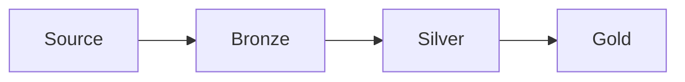

# RideNow Enterprise Data Platform

# 07. Documentation Standards

---

# Document Information

| Property | Value |
|----------|-------|
| Project | RideNow Enterprise Data Platform |
| Document | Documentation Standards |
| Version | 1.0 |
| Author | Manmeet Singh |
| Last Updated | 15-Jul-2026 |
| Status | Approved |

---

# Revision History

| Version | Date | Author | Description |
|----------|------|--------|-------------|
| 1.0 | 15-Jul-2026 | Manmeet Singh | Initial Documentation Standards |

---

# Table of Contents

1. Purpose
2. Scope
3. Documentation Philosophy
4. Standard Document Structure
5. Document Naming Standards
6. Folder Organization
7. Markdown Standards
8. Heading Standards
9. Table Standards
10. Diagram Standards
11. Image Standards
12. SQL Code Standards
13. Python Code Standards
14. Version Control
15. Review Process
16. Document Lifecycle
17. Writing Guidelines
18. Quality Checklist
19. Best Practices
20. Appendix

---

# 1. Purpose

This document defines the documentation standards for the RideNow Enterprise Data Platform.

Objectives:

- Maintain consistency
- Improve readability
- Simplify maintenance
- Support onboarding
- Enable knowledge sharing
- Produce enterprise-quality documentation

---

# 2. Scope

These standards apply to all documentation within the repository including:

- Project Documentation
- Architecture Documents
- Design Documents
- Standards
- FAQs
- SQL Documentation
- Python Documentation
- Snowflake Documentation
- Power BI Documentation
- README files

---

# 3. Documentation Philosophy

Documentation should be:

- Accurate
- Complete
- Easy to understand
- Easy to maintain
- Version controlled
- Written for both technical and business users

Good documentation should answer:

- What?
- Why?
- How?
- Who?
- When?

---

# 4. Standard Document Structure

Every major document must contain the following sections.

```text
Title

Document Information

Revision History

Table of Contents

Purpose

Main Content

Examples

Best Practices

Conclusion
```

Optional sections

- References
- Appendix
- Glossary
- FAQ

---

# 5. Document Naming Standards

Documents should be numbered.

Example

```text
01_Project_Charter.md

02_Business_Requirements.md

03_High_Level_Design.md

04_Low_Level_Design.md

05_Data_Model.md
```

Standards

```text
01_Naming_Standards.md

04_SQL_Coding_Standards.md
```

FAQs

```text
01_Project_FAQ.md

02_Snowflake_FAQ.md
```

---

# 6. Folder Organization

```text
docs/

│
├── standards/
├── faq/
│
├── 01_Project_Charter.md
├── 02_Business_Requirements.md
├── 03_High_Level_Design.md
├── 04_Low_Level_Design.md
├── 05_Data_Model.md
├── README.md
```

Each folder should contain a README.md describing its purpose.

---

# 7. Markdown Standards

Use Markdown consistently.

Preferred

```markdown
# Title

## Section

### Subsection
```

Avoid skipping heading levels.

Correct

```text
# Heading

## Sub Heading

### Topic
```

Incorrect

```text
# Heading

#### Topic
```

---

# 8. Heading Standards

Use numbered headings for primary sections.

Example

```text
# 1. Purpose

# 2. Scope

# 3. Design
```

Subsections

```text
## 3.1 Overview

## 3.2 Components
```

---

# 9. Table Standards

Use Markdown tables for structured information.

Example

| Column | Description |
|----------|-------------|
| CUSTOMER_ID | Business Identifier |
| CUSTOMER_SK | Surrogate Key |

Keep tables aligned and easy to read.

---

# 10. Diagram Standards

Use diagrams whenever they improve understanding.

Preferred diagrams

- Architecture Diagram
- ER Diagram
- Star Schema
- ETL Flow
- Sequence Diagram
- Data Flow Diagram
- Process Flow

Simple diagrams may be created using Mermaid.

Example



---

# 11. Image Standards

Store images under:

```text
docs/images/
```

Rules

- Use PNG or SVG
- Avoid screenshots where diagrams are available
- Name images descriptively

Example

```text
snowflake_architecture.png

etl_pipeline.png

star_schema.svg
```

---

# 12. SQL Code Standards

All SQL examples should use syntax highlighting.

```sql
SELECT
    CUSTOMER_ID,
    CUSTOMER_NAME
FROM CUSTOMER_DIM;
```

Do not include incomplete SQL snippets.

---

# 13. Python Code Standards

Always specify the language.

```python
def generate_customer():
    pass
```

Examples should be executable where practical.

---

# 14. Version Control

Every document should contain:

- Version
- Last Updated
- Revision History
- Author

Major updates should increment the document version.

---

# 15. Review Process

Every document should be reviewed for:

- Technical accuracy
- Grammar
- Formatting
- Naming consistency
- Broken links
- Outdated information

---

# 16. Document Lifecycle

```text
Draft

↓

Review

↓

Approved

↓

Published

↓

Maintained

↓

Archived
```

Every document should have a status.

Examples

```text
Draft

Review

Approved

Deprecated

Archived
```

---

# 17. Writing Guidelines

Use:

- Clear language
- Active voice
- Short paragraphs
- Bullet lists
- Real examples

Avoid

- Slang
- Ambiguous terms
- Unexplained abbreviations
- Long paragraphs

---

# 18. Quality Checklist

| Item | Status |
|------|--------|
| Purpose defined | □ |
| Version updated | □ |
| Revision history included | □ |
| TOC included | □ |
| Examples provided | □ |
| Diagrams added | □ |
| Grammar reviewed | □ |
| Markdown validated | □ |
| Links verified | □ |
| Approved | □ |

---

# 19. Best Practices

- Keep documentation close to the code.
- Update documentation with every significant change.
- Prefer examples over long explanations.
- Use consistent terminology across all documents.
- Link related documents where appropriate.
- Avoid duplicate content.
- Review documentation regularly.
- Keep diagrams up to date.
- Write for future team members.

---

# 20. Appendix

## Standard Header Template

```markdown
# RideNow Enterprise Data Platform

# Document Name

---

# Document Information

| Property | Value |
|----------|-------|
| Project | RideNow Enterprise Data Platform |
| Document | Document Name |
| Version | 1.0 |
| Author | Manmeet Singh |
| Last Updated | DD-MMM-YYYY |
| Status | Approved |
```

---

## Standard Footer

```text
Document Status : Approved

Version : 1.0

Maintained By : Manmeet Singh

Project : RideNow Enterprise Data Platform
```

---

# Conclusion

Consistent documentation is a critical component of the RideNow Enterprise Data Platform. By following these standards, every document will have a uniform structure, professional appearance, and clear purpose. This improves collaboration, simplifies onboarding, and ensures the repository remains maintainable as the project grows.

---

**Document Status:** Approved

**Version:** 1.0

**Maintained By:** Manmeet Singh

**Project:** RideNow Enterprise Data Platform
